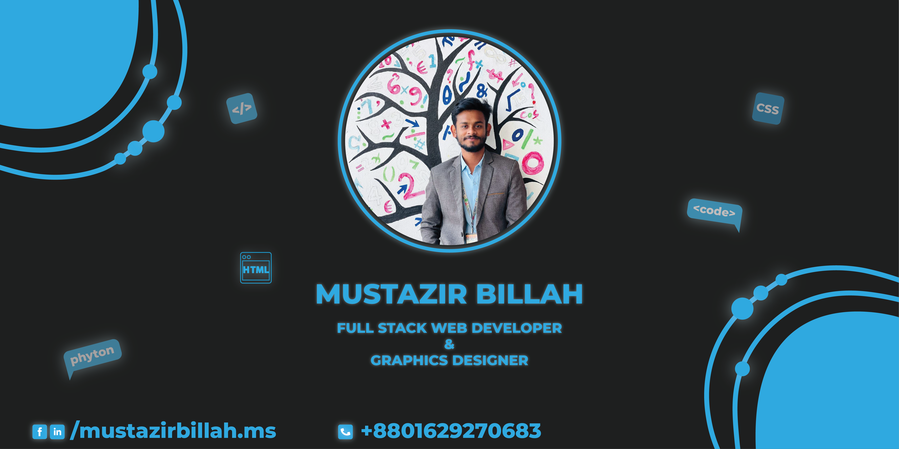

  

<h1 align="center">S.M.Mustazir Billah</h1>

###

<h2 align="center">Full Stack WebDeveloper & Graphics Designer</h2>

###

<h2 align="left">About Me</h2>

###

I'm Mustazir Billah, a passionate full-stack developer and graphics designer from Rangpur, Dhaka. Currently, I’m exploring machine learning, web development, and design to create innovative solutions. I’m always eager to learn new technologies and collaborate on exciting projects to enhance my skills and contribute to the tech community.

###

<h2 align="left">🌱 Learning & Growing</h2>

###

🔭 I’m working on - Full-stack web development, machine learning, and graphics design. 🌱 I’m exploring - Gaming-based and anime-based ML projects. 👯 I’m looking - To collaborate on web development, data-driven projects, and creative designs. 💬 Ask me about - JavaScript, React, Vite, SQL, MongoDB, Express, Linux servers, and design tools. 🎮 When I’m free - I play games, watch anime, and experiment with new design ideas! 🔥 Always creating something exciting! 😉

###

<h2 align="left">Technologies that I know :</h2>

###

<h3 align="center">Development</h3>

###

<h3 align="center">🌐 Frontend Development</h3>

###

  
  
  
  
  
  
  
  
  

###

<h3 align="center">🛠 Backend Development</h3>

###

  
  
  

###

<h3 align="center">🗄 Databases</h3>

###

  
  
  

###

<h4 align="center">💻 Programming Languages</h4>

###

  
  
  
  
  
  
  
  
  

###

<h4 align="center">✨Graphics Designing</h4>

###

  
  
  
  
  
  
  

###

<h4 align="center">🔧 Tools & Platforms</h4>

###

  
  
  

###

<h2 align="center">Reach me out</h2>

###

  
  
  
  

###

  

###

    
    
    
  

###
